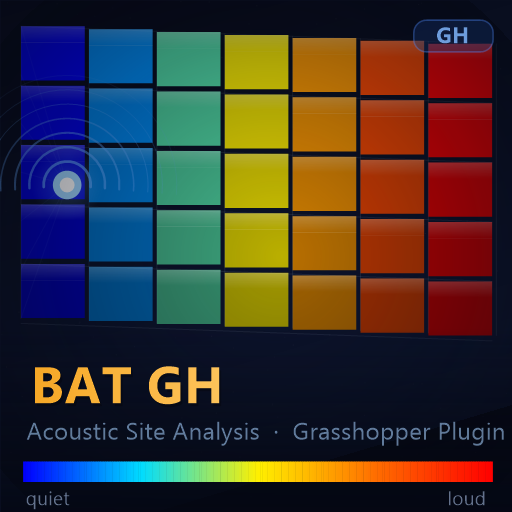
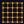

# Bat GH

<p align="center">
  
</p>

<p align="center">
  
  
  
  
  
</p>

> **Acoustic site analysis for Grasshopper.**  
> Paint live noise heat-maps on any facade, extract isodecibel contours, score interior noise exposure, and let Galapagos minimise it — all self-contained, no Ladybug required.

---

## Why "Bat"?

Bats navigate by emitting sound and listening to the echoes — acoustic ray tracing. Bat GH does the same: it fires rays from noise sources, bounces them off surfaces, and measures what arrives at each face. The name also fits the Grasshopper animal-plugin tradition (Ladybug, Weaverbird, Kangaroo, Pufferfish, Elk…).

---

## Components

All six components live under **Analysis → Acoustic** in the Grasshopper toolbar.

| Icon | Name | Nickname | What it does |
|------|------|----------|--------------|
|  | **BT Source** | BT Src | Define point and line (road / rail) noise sources |
|    | **BT Mesh**   | BT Msh | Convert any geometry to an analysis mesh |
|   | **BT Noise**  | BT Nse | Core analysis: direct + reflected noise, heat-map, compliance |
|  | **BT Interior** | BT Int | Interior exposure score — wire to Galapagos for topology optimisation |
|  | **BT Contours** | BT Con | Extract isodecibel contour polylines as a data tree |
|  | **BT Legend** | BT Leg | Draw a dB colour-scale legend in the Rhino viewport |

---

## Typical workflow

```
┌──────────────────────────────────────────────────────────────────────┐
│                                                                      │
│  Parametric geometry     Noise source(s)     Interior point         │
│      (sliders)               (Point)            (Point)             │
│          │                      │                  │                │
│          ▼                      │                  │                │
│   ┌─────────────┐               │                  │                │
│   │  BT Mesh    │               │                  │                │
│   │  G ← facade │               │                  │                │
│   └──────┬──────┘               │                  │                │
│          │ Mesh  ┌──────────────┘                  │                │
│          │       │  Sources, Levels                 │                │
│          ▼       ▼                                  │                │
│   ┌─────────────────────────────────────────┐       │                │
│   │              BT Source                  │       │                │
│   │  P ← points   T ← curves               │       │                │
│   └────────────────────┬────────────────────┘       │                │
│                        │ Sources, Levels             │                │
│                        ▼                            ▼                │
│          ┌─────────────────────────────────────────────┐             │
│          │                  BT Noise                   │             │
│          │  M ← mesh    S ← sources   IP ← interior   │             │
│          │  R = true    α = 3.0   Lim ← WHO limit     │             │
│          └──┬──────────────────┬──────────────────┬───┘             │
│             │ Mesh             │ Face dB           │ Min/Max         │
│             ▼                 ▼                   ▼                 │
│       ┌──────────┐   ┌─────────────────┐  ┌──────────────┐         │
│       │BT Contour│   │  BT Interior    │  │  BT Legend   │         │
│       │ L={50..75}│   │  IntdB → Galap │  │  O ← origin  │         │
│       └──────────┘   └─────────────────┘  └──────────────┘         │
│                                                                      │
└──────────────────────────────────────────────────────────────────────┘
```

---

## Acoustic model

### Direct sound

```
L = L_src − 20·log₁₀(d) − 11 + 10·log₁₀(cos θ + 0.01)
```

| Symbol | Meaning |
|--------|---------|
| `L_src` | Source sound power level (dB SPL) |
| `d` | Distance source → face centroid, clamped ≥ 0.1 m |
| `θ` | Angle of incidence (face normal vs. direction to source) |

Multiple sources combine by energy summation:

```
L_total = 10·log₁₀( Σ 10^(Lᵢ / 10) )
```

### First-order reflections

```
reflected dir  =  d̂ − 2·(d̂·n̂)·n̂

L_ref = L_src − 20·log₁₀(d₁+d₂) − 11 + 10·log₁₀(cos θ + 0.01) − α_dB − mat_loss
```

`α_dB` is the user-supplied bounce loss (default 3 dB). `mat_loss` comes from per-face absorption coefficients:

```
mat_loss = −10·log₁₀(1 − α)   where  α ∈ [0, 0.99]
```

### Interior exposure score

Each facade face acts as a secondary source radiating inward:

```
E_int = Σ [ 10^(dBᵢ/10) × area_i / dist_i² ]

Interior dB = 10·log₁₀(E_int)
```

Connect **Interior dB** → Galapagos fitness input, set to **Minimise**.

### Line / road sources (BT Source)

A curve of total level `L_total` is divided into `N` sub-points, each emitting:

```
L_sub = L_total − 10·log₁₀(N)
```

so the sum reconstructs the original energy exactly.

---

## Component reference

### BT Source

| # | Input | Type | Default | Description |
|---|-------|------|---------|-------------|
| 0 | Point Sources | Point list | — | Individual point sources |
| 1 | Point dB | number list | — | Level for each point source |
| 2 | Rail/Road | Curve list | — | Line sources (roads, railways) |
| 3 | Line dB | number list | — | Level for each line source |
| 4 | Subdivisions | integer | 20 | Sub-points along each curve |

Outputs: **Sources** (Point list), **Levels** (dB list), **Count**.

---

### BT Mesh

| # | Input | Type | Default | Description |
|---|-------|------|---------|-------------|
| 0 | Geometry | GeometryBase list | — | Mesh, Surface, Brep, SubD, Extrusion |
| 1 | Quality | integer | 1 | 0 fast → 3 fine |

Outputs: **Mesh** (analysis mesh), **Face Count**, **Area** (m²).

---

### BT Noise

| # | Input | Type | Default | Description |
|---|-------|------|---------|-------------|
| 0 | Mesh | Mesh | — | From BT Mesh |
| 1 | Sources | Point list | — | From BT Source |
| 2 | Levels | number list | — | From BT Source |
| 3 | Min dB | number | auto | Pin colour-scale lower bound |
| 4 | Max dB | number | auto | Pin colour-scale upper bound |
| 5 | Reflections | boolean | false | First-order ray-cast reflections |
| 6 | Absorption α | number | 3.0 | Bounce loss per reflection (dB) |
| 7 | Materials | number list | — | Per-face absorption coefficient 0–1 |
| 8 | Limit dB | number | — | WHO / regulatory limit — activates compliance overlay |

| # | Output | Description |
|---|--------|-------------|
| 0 | Mesh | Vertex-coloured facade mesh |
| 1 | Face dB | Per-face dB → BT Interior / BT Contours |
| 2 | Min dB | Colour-scale minimum → BT Legend |
| 3 | Max dB | Colour-scale maximum → BT Legend |
| 4 | Exceeded m² | Facade area above Limit dB |
| 5 | % Exceeded | Percentage of facade area above limit |
| 6 | Reflect Mesh | Heat-map of reflection hotspots |

---

### BT Interior

| # | Input | Type | Description |
|---|-------|------|-------------|
| 0 | Mesh | Mesh | From BT Noise |
| 1 | Face dB | number list | From BT Noise |
| 2 | Interior Pt | Point | Point inside the building |

| # | Output | Description |
|---|--------|-------------|
| 0 | Interior dB | Exposure score → Galapagos fitness (minimise) |
| 1 | Area-wtd mean | Area-weighted mean facade dB |
| 2 | Peak face dB | Loudest single face |

---

### BT Contours

| # | Input | Type | Description |
|---|-------|------|-------------|
| 0 | Mesh | Mesh | From BT Noise |
| 1 | Face dB | number list | From BT Noise |
| 2 | Levels | number list | dB levels to contour — e.g. {50,55,60,65,70,75} |

Outputs: **Contours** (curve data tree — one branch per level), **Levels** (list), **Count**.

---

### BT Legend

| # | Input | Type | Default | Description |
|---|-------|------|---------|-------------|
| 0 | Origin | Point | (0,0,0) | Base-left corner in world space |
| 1 | Min dB | number | 40 | From BT Noise Min |
| 2 | Max dB | number | 80 | From BT Noise Max |
| 3 | Height | number | 5 | Bar height (model units) |
| 4 | Width | number | 1 | Bar width (model units) |
| 5 | Ticks | integer | 5 | Number of tick labels |
| 6 | Limit dB | number | — | Draw limit line on legend |

Outputs: **Legend Mesh** (bake to make permanent), **Labels** (text), **Label Pts** (positions).

---

## Colour gradient

| Colour | Maps to |
|--------|---------|
| Blue `(0, 0, 255)` | Scale minimum — quietest |
| Cyan `(0, 220, 255)` | 25 % |
| Yellow `(255, 240, 0)` | 50 % |
| Orange `(255, 110, 0)` | 75 % |
| Red `(255, 0, 0)` | Scale maximum — loudest |

When **Limit dB** is connected the overlay switches to: green → yellow → orange → red relative to the regulatory limit.

---

## Installation

### Release (recommended)

1. Download `BatGH.gha` from [Releases](../../releases)
2. Right-click → Properties → **Unblock** (Windows security zone)
3. Copy to `%APPDATA%\Grasshopper\Libraries\`
4. Restart Rhino — components appear under **Analysis → Acoustic**

### Build from source

Requirements: .NET SDK, Rhino 8

```bat
git clone https://github.com/LCS3002/NoiseFacadeGH
cd NoiseFacadeGH
build.bat
```

`build.bat` generates the icons, compiles, and installs `BatGH.gha` automatically. Close Rhino before running.

---

## Requirements

- Rhino 8 (RhinoCommon 8.x, Grasshopper 1.x)
- .NET Framework 4.8
- No Ladybug, Food4Rhino or other plugins required

---

## Project structure

```
NoiseFacadeGH/
├── BatInfo.cs              # Assembly info, icon loader, brand colours
├── BatAcoustics.cs         # All acoustic math (direct, reflections, interior, contours)
├── BatContourAlgo.cs       # Marching-triangles isodecibel extractor
├── BatSourceComponent.cs   # BT Source — point + line sources
├── BatMeshComponent.cs     # BT Mesh — geometry conversion
├── BatNoiseComponent.cs    # BT Noise — core analysis
├── BatInteriorComponent.cs # BT Interior — Galapagos fitness
├── BatContoursComponent.cs # BT Contours — data tree of polylines
├── BatLegendComponent.cs   # BT Legend — viewport colour scale
├── NoiseFacadeGH.csproj    # SDK-style .NET 4.8 project
├── build.bat               # One-click build + install
├── Bat_24.png              # Assembly icon 24 px (embedded)
├── Bat_48.png              # Assembly icon 48 px (embedded)
├── BatSource_24.png        # Component icons (embedded)
├── BatMesh_24.png
├── BatNoise_24.png
├── BatInterior_24.png
├── BatContours_24.png
├── BatLegend_24.png
├── BatGH_logo.png          # 512 px logo for GitHub
├── GenerateIcon/           # Icon generator (System.Drawing, no Rhino dep)
└── MathTest/               # 65-test battle suite for all acoustic math
```

---

## License

MIT — see [LICENSE](LICENSE)
